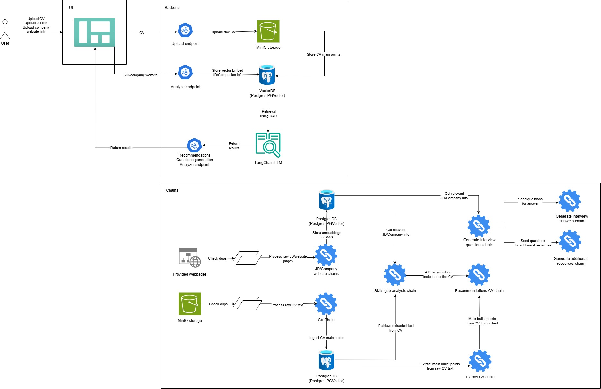

# Job Research Assistant

## Project Overview

The Job Research Assistant is an AI-powered application that helps job seekers analyze job descriptions, research companies, and prepare for interviews. The system leverages LangChain, vector databases, and LLMs to provide intelligent insights and recommendations based on uploaded CVs and job postings.

## Key Features

- **CV Upload & Analysis** - Upload and parse CV/resume documents
- **Job Description Processing** - Analyze job postings and extract key requirements
- **Company Research** - Gather and analyze company information
- **Skills Gap Analysis** - Compare CV skills with job requirements
- **Interview Preparation** - Generate interview questions and preparation materials
- **Recommendation System** - Provide personalized job recommendations
- **Vector Search** - Semantic search capabilities for job matching

## Tech Stack


### Backend
- **FastAPI** - Modern, fast web framework for building APIs
- **LangChain** - Framework for developing LLM-powered applications
- **PostgreSQL with PGVector** - Vector database for storing embeddings
- **MinIO** - Object storage for file management
- **Pydantic** - Data validation and settings management
- **Python** - Core programming language

### Frontend
- **Plotly Dash** - Interactive web applications and dashboards

### Infrastructure
- **Docker & Docker Compose** - Containerization and orchestration
- **Uvicorn** - ASGI server for FastAPI

### AI/ML Components
- **Large Language Models** - For natural language processing
- **Vector Embeddings** - For semantic search and similarity matching
- **RAG (Retrieval-Augmented Generation)** - For context-aware responses

## Project Structure

```markdown:/home/mlai18/ml_playground/job-research-assistant/README.md
<code_block_to_apply_changes_from>
job-research-assistant/
├── backend/                          # FastAPI backend application
│   ├── api_utils/                   # API utility functions
│   ├── core_langchain/              # LangChain integration
│   │   ├── base_chains/             # Chain implementations
│   │   ├── base_prompts/            # Prompt templates
│   │   ├── factory/                 # Factory patterns
│   │   └── response_schemas/        # Response data models
│   ├── db_connectors/               # Database connectors
│   │   ├── minio/                   # MinIO storage connector
│   │   └── postgres/                # PostgreSQL connector
│   ├── endpoints/                   # API endpoints
│   │   ├── analyze_endpoints.py     # Job analysis endpoints
│   │   ├── interview_prep_endpoints.py # Interview preparation
│   │   └── upload_endpoints.py      # File upload endpoints
│   ├── general_utils/               # General utility functions
│   ├── pydantic_models/             # Data models
│   ├── services/                    # Business logic services
│   ├── app.py                       # FastAPI application entry point
│   ├── config.py                    # Configuration management
│   ├── requirements.txt             # Python dependencies
│   └── Dockerfile                   # Backend container definition
├── frontend/                        # Plotly Dash frontend (to be implemented)
├── deployments/                     # Deployment configurations
│   └── docker-compose.yaml          # Multi-service orchestration
├── notebooks/                       # Jupyter notebooks for testing
│   └── test_backend.ipynb           # Backend testing notebook
├── images/                          # Project documentation images
│   └── job_research_assistant.jpg   # Architecture diagram
├── logs/                            # Application logs
├── .gitignore                       # Git ignore rules
└── README.md                        # Project documentation
```

## To-dos
- [ ] Complete Plotly Dash frontend implementation
- [ ] Implement user authentication and session management
- [ ] Add unit and integration tests
- [ ] Complete Docker Compose configuration for all services