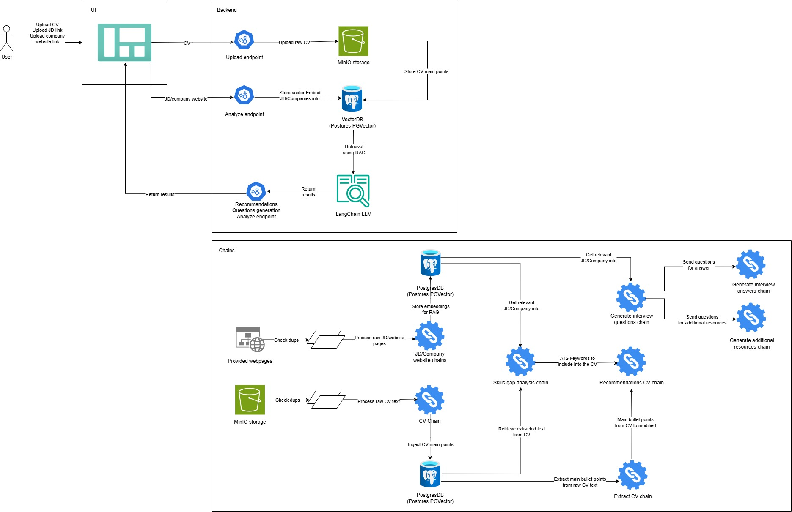

# Job Research Assistant

## Project Overview

The Job Research Assistant is an AI-powered application that helps job seekers analyze job descriptions, research companies, and prepare for interviews. The system leverages LangChain, vector databases, and LLMs to provide intelligent insights and recommendations based on uploaded CVs and job postings.

## Key Features

- **CV Upload & Analysis** - Upload and parse CV/resume documents
- **Job Description Processing** - Analyze job postings and extract key requirements
- **Company Research** - Gather and analyze company information
- **Skills Gap Analysis** - Compare CV skills with job requirements
- **Interview Preparation** - Generate interview questions and preparation materials
- **Recommendation System** - Provide personalized job recommendations
- **Vector Search** - Semantic search capabilities for job matching

## Tech Stack
### Backend


- **FastAPI** - Modern, fast web framework for building APIs
- **LangChain** - Framework for developing LLM-powered applications
- **PostgreSQL with PGVector** - Vector database for storing embeddings
- **MinIO** - Object storage for file management
- **Pydantic** - Data validation and settings management
- **Python** - Core programming language

### Frontend
- **Plotly Dash** - Interactive web applications and dashboards
- **Workflow** - Login/Sign up -> Upload your CV -> AI-Powered CV Analysis -> Interview preparation

https://github.com/user-attachments/assets/37e70bfa-5eec-47b4-bedc-6044fc965e6a

### Infrastructure
- **Docker & Docker Compose** - Containerization and orchestration
- **Uvicorn** - ASGI server for FastAPI

### AI/ML Components
- **Large Language Models** - For natural language processing
- **Vector Embeddings** - For semantic search and similarity matching
- **RAG (Retrieval-Augmented Generation)** - For context-aware responses

## Project Structure

```
job-research-assistant/
├── backend/ # FastAPI backend application
│ ├── api_utils/ # API utility functions and business logic
│ │ ├── analyze_api_utils.py # CV analysis and job matching utilities
│ │ ├── cv_data_crud_utils.py # CV data CRUD operations
│ │ ├── embeddings_data_crud_utils.py # Vector embeddings management
│ │ ├── interviews_prep_api_utils.py # Interview preparation utilities
│ │ ├── upload_api_utils.py # File upload processing
│ │ └── users_crud_api_utils.py # User management utilities
│ ├── core_langchain/ # LangChain AI integration
│ │ ├── base_chains/ # Chain implementations for AI workflows
│ │ │ ├── cv_chains.py # CV processing chains
│ │ │ ├── company_parser_chains.py # Company data extraction
│ │ │ └── jd_chains.py # Job description processing
│ │ ├── base_prompts/ # AI prompt templates
│ │ │ ├── cv_prompts.py # CV analysis prompts
│ │ │ ├── company_parser_prompts.py # Company parsing prompts
│ │ │ └── jd_prompts.py # Job description prompts
│ │ ├── factory/ # Factory patterns for AI components
│ │ │ └── chains_factory.py # Chain creation factory
│ │ └── response_schemas/ # Pydantic response models for AI
│ │ ├── cv_response_schemas.py # CV parsing schemas
│ │ ├── company_parser_response_schemas.py # Company data schemas
│ │ └── jd_response_schemas.py # Job description schemas
│ ├── db_connectors/ # Database and storage connectors
│ │ ├── minio/ # MinIO object storage connector
│ │ │ └── minio_client.py # MinIO client implementation
│ │ └── postgres/ # PostgreSQL database connector
│ │ └── postgres_client.py # PostgreSQL client with CRUD operations
│ ├── endpoints/ # FastAPI route definitions
│ │ ├── analyze_endpoints.py # CV analysis and job matching endpoints
│ │ ├── cv_data_crud_endpoints.py # CV data management endpoints
│ │ ├── embeddings_data_crud_endpoints.py # Vector embeddings endpoints
│ │ ├── interview_prep_endpoints.py # Interview preparation endpoints
│ │ ├── upload_endpoints.py # File upload endpoints
│ │ └── users_crud_endpoints.py # User management endpoints
│ ├── general_utils/ # General utility functions
│ │ ├── logging.py # Logging configuration
│ │ └── pdf_utils.py # PDF processing utilities
│ ├── pydantic_models/ # Data models and schemas
│ │ ├── postgres_be_models.py # Database models (SQLAlchemy)
│ │ └── users_crud_models.py # User management models
│ ├── services/ # Business logic services (service layer)
│ │ ├── analyze_services.py # CV analysis service
│ │ ├── interview_prep_services.py # Interview preparation service
│ │ ├── upload_services.py # File upload service
│ │ └── users_crud_services.py # User management service
│ ├── app.py # FastAPI application entry point
│ ├── config.py # Environment configuration management
│ ├── requirements.txt # Python dependencies
│ └── Dockerfile # Backend container definition
├── frontend/ # Plotly Dash frontend application
│ ├── assets/ # Static assets
│ │ └── custom.css # Custom CSS styles
│ ├── components/ # Dash component modules
│ │ ├── analyze_screen.py # CV analysis interface
│ │ ├── authentication_screen.py # User authentication interface
│ │ ├── base_components.py # Reusable UI components
│ │ ├── dashboard_screen.py # Main dashboard interface
│ │ ├── interview_screen.py # Interview preparation interface
│ │ └── upload_screen.py # File upload interface
│ ├── utils/ # Frontend utilities
│ │ └── backend_api_client.py # Backend API client
│ ├── app.py # Dash application entry point
│ └── requirements.txt # Frontend Python dependencies
├── deployments/ # Deployment configurations
│ └── docker-compose.yaml # Multi-service orchestration
├── notebooks/ # Jupyter notebooks for development and testing
│ └── test_backend.ipynb # Backend API testing and experimentation
├── images/ # Project documentation images
│ └── job_research_assistant.jpg # Architecture diagram
├── logs/ # Application logs directory
│ ├── backend/ # Backend service logs
│ └── frontend/ # Frontend service logs
├── .gitignore # Git ignore rules
└── README.md # Project documentation
```

## To-dos
- [ ] Add unit and integration tests

## Setup Instructions

## Prerequisites

- **Python 3.12 or higher**
- **Docker & Docker Compose** (recommended for easy setup)
- **PostgreSQL** (if running without Docker)
- **MinIO** (if running without Docker)
- **OpenAI API Key** (for LLM functionality)

### Quick Start with Docker Compose (Recommended)

1. **Clone the repository:**
   ```bash
   git clone <repository-url>
   cd job-research-assistant
   ```

2. **Create environment file:**
   Create a `.env` file in the `deployments/` directory:
   ```bash
   # deployments/.env
   BACKEND_URL=http://job_research_assistant_fastapi_backend:80
   SECRET_KEY=your-super-secret-jwt-key-here
   ALGORITHM=HS256
   EXPIRATION_MINUTES=30

   # Database Configuration
   POSTGRES_USER=postgres
   POSTGRES_PASSWORD=your-secure-password
   POSTGRES_DB=job_research_db
   POSTGRES_PORT=5432
   POSTGRES_HOST=postgres

   # MinIO Configuration
   MINIO_ENDPOINT=minio:9000
   MINIO_ACCESS_KEY=minioadmin
   MINIO_SECRET_KEY=minio-secret-key

   # AI Configuration
   OPENAI_API_KEY=your-openai-api-key-here
   ```

3. **Build and start all services:**
   ```bash
   cd deployments
   docker compose down
   docker compose up --build -d
   ```

4. **Access the application:**
   - **Frontend**: http://localhost:38050
   - **Backend API**: http://localhost:18050
   - **API Documentation**: http://localhost:18050/docs

### Manual Setup (Development)

#### Backend Setup

1. **Navigate to the backend directory:**
   ```bash
   cd backend
   ```

2. **Create a virtual environment:**
   ```bash
   python -m venv venv
   source venv/bin/activate  # On Windows: venv\Scripts\activate
   ```

3. **Install dependencies:**
   ```bash
   pip install -r requirements.txt
   ```

4. **Set up environment variables:**
   Create a `.env` file in the `backend/` directory:
   ```bash
   # backend/.env
   MINIO_ENDPOINT=localhost:9000
   MINIO_ACCESS_KEY=minioadmin
   MINIO_SECRET_KEY=minio-secret-key
   OPENAI_API_KEY=your-openai-api-key-here
   POSTGRES_USER=postgres
   POSTGRES_PASSWORD=your-password
   POSTGRES_DB=job_research_db
   POSTGRES_PORT=5432
   POSTGRES_HOST=localhost
   ```

5. **Set up PostgreSQL with PGVector:**
   ```bash
   # Install PostgreSQL and create database
   createdb job_research_db

   # Install PGVector extension (requires PostgreSQL with vector support)
   psql job_research_db -c "CREATE EXTENSION IF NOT EXISTS vector;"
   ```

6. **Set up MinIO (Object Storage):**
   ```bash
   # Run MinIO server
   docker run -p 9000:9000 -p 9001:9001 \
     -e "MINIO_ROOT_USER=minioadmin" \
     -e "MINIO_ROOT_PASSWORD=minio-secret-key" \
     minio/minio server /data --console-address ":9001"
   ```

7. **Start the backend server:**
   ```bash
   uvicorn app:app --host 0.0.0.0 --port 80 --reload
   ```

#### Frontend Setup

1. **Navigate to the frontend directory:**
   ```bash
   cd frontend
   ```

2. **Create a virtual environment:**
   ```bash
   python -m venv venv
   source venv/bin/activate  # On Windows: venv\Scripts\activate
   ```

3. **Install dependencies:**
   ```bash
   pip install -r requirements.txt
   ```

4. **Set up environment variables:**
   Create a `.env` file in the `frontend/` directory:
   ```bash
   # frontend/.env
   BACKEND_URL=http://localhost:80
   SECRET_KEY=your-super-secret-jwt-key-here
   ALGORITHM=HS256
   EXPIRATION_MINUTES=30
   ```

5. **Start the frontend server:**
   ```bash
   python app.py
   ```

6. **Access the application:**
   Open your browser and visit http://localhost:8050

## Contributing

1. Fork the repository
2. Create a feature branch (`git checkout -b feature/amazing-feature`)
3. Commit your changes (`git commit -m 'Add some amazing feature'`)
4. Push to the branch (`git push origin feature/amazing-feature`)
5. Open a Pull Request

## License

This project is licensed under the MIT License - see the [LICENSE](LICENSE) file for details.
